<div align="center">
<svg width="780" height="180" viewBox="0 0 780 180" xmlns="http://www.w3.org/2000/svg">
  <defs>
    <linearGradient id="bg" x1="0%" y1="0%" x2="100%" y2="100%">
      <stop offset="0%" stop-color="#0b0b0b"/>
      <stop offset="100%" stop-color="#1a1400"/>
    </linearGradient>
    <linearGradient id="gld" x1="0%" y1="0%" x2="100%" y2="0%">
      <stop offset="0%" stop-color="#f0b90b"/>
      <stop offset="100%" stop-color="#fcd535"/>
    </linearGradient>
  </defs>
  <rect width="780" height="180" fill="url(#bg)" rx="14"/>
  <circle cx="90" cy="90" r="6" fill="#f0b90b">
    <animate attributeName="r" values="6;26;6" dur="2.4s" repeatCount="indefinite"/>
    <animate attributeName="opacity" values="1;0;1" dur="2.4s" repeatCount="indefinite"/>
  </circle>
  <circle cx="90" cy="90" r="6" fill="#f0b90b"/>
  <text x="158" y="76" font-family="'Courier New', monospace" font-size="36" font-weight="800" fill="url(#gld)">PulseBNB Agent</text>
  <text x="160" y="110" font-family="'Courier New', monospace" font-size="15" fill="#bdbdbd">A paid, callable contract-intelligence agent on CROO.</text>
  <text x="160" y="134" font-family="'Courier New', monospace" font-size="15" fill="#7a7a7a">Send any BNB address. Pay USDC. Get an AI verdict: real builder or noise.</text>
</svg>
<br/>



</div>
---
> **The pitch:** Anyone can pay this agent a small USDC fee, send it any BNB Chain contract address, and get back an AI verdict — *real builder* or *ecosystem noise* — with a reason and a confidence score. It's the [PulseBNB](https://pulsebnb-web.vercel.app) classifier, wrapped as a paid, callable agent on the CROO Agent Protocol.
What you get back
```json
{
  "verdict": "real",
  "confidence": 85,
  "reason": "Unique sale vault deployer with custom logic",
  "contract_name": "RuyiBeastSaleVaultDeployer",
  "contract_type": "OTHER",
  "verified": true,
  "source": "PulseBNB — AI contract intelligence on BNB Chain"
}
```
Why
Every contract that hits BNB Chain runs through an AI classifier. Forks, templates, and copy-paste tokens get filtered. What's left is signal — the builders worth finding before the airdrop, the VC, or the chart. PulseBNB makes that signal callable and payable by anyone, or any other agent.
How it works
On paid order, read the target address from the CAP negotiation requirements.
Fetch on-chain facts — bytecode via BNB RPC, ERC-type detection from function selectors, name + verification via block explorer.
Classify with AI (Cerebras `gpt-oss-120b`), tuned to separate original builders from recycled noise.
Deliver a SCHEMA verdict on-chain; USDC settles to the provider.
Hardened for real callers: empty or malformed requirements never crash the provider — it returns a schema hint or a showcase classification, keeping completion at 100% even when a caller's UI hides the requirements field.
Part of a composable system
PulseBNB is the signal layer of a two-agent system. Its companion, BNB Builder Scout, is the reputation layer — it pays PulseBNB to grade a deployer's contracts and composes them into a portable reputation score. One agent hiring another, settled on-chain.
🔗 Verified On-Chain — Base Mainnet
Every order is a real CAP settlement. Verify any: `https://basescan.org/tx/<hash>`
Order	Verdict	Delivery tx
`89f94f2b`	real	`0x1b3c7cf3b7b5cf2a6d46100998dea96be32cff43e3e4cf5f19393ccdf262924d`
`b1b21dbb`	real	`0xc0ea24d9f62a8eb65a0e87a7403f854e1aee1181e4a7e0dcb5f4af7e902277d1`
`9237014b`	real	`0x47766d8e693497a4524429d1c9ba21285431468c28818d78f5d73a8dab14a75b`
`ad354c40`	real	`0xe4b59a2e80daa4ab786ff8671cb32b9fa85b0455d1cd03f9e2c92d24460b075a`

`76e5635c`	real	`0x798aaf2ed24b7f5a67b4e7811501abf1b9487279f5f96719b3f4cdbfceba4c05`
`8845b764`	noise	`0xd19f5b9957242c600aaad595b362a2f4b68ff8be4d3825c7053bc7953f77c345`
`1720d5d2`	noise	`0x8627c49e3a8ac3f663a8b295237a330ca06d6fed98be31df0ca9a794378d8413`
11+ orders · 100% completion · <1 min avg delivery · real external buyers
Cross-team A2A
Our project placed real paid orders on other builders' agents (`ours:false`) — proving PulseBNB lives in a real cross-team economy:
Called	Team	Pay tx
VeriClaim	Artema	`0x254359c28e313555cfd7de8a91aeeeebbf0d1beba183fe20759023cfea39a8a2`
Manga Localizer	abdulmajeed	`0x79608c7c223fd5b3ee7bd3e9719df184e20f52a9dd2467591c503daccab1ae5d`
ZERU	Precious_Noah	`0x99eaa5202e4d9c358efa8bb73ee96f5b0fe57288bef977845b5969064ba8505e`
Tech stack
Layer	Choice
Agent protocol	CROO CAP (`croo-sdk`, Python)
Classifier	Cerebras `gpt-oss-120b` via LiteLLM
On-chain facts	BNB RPC + block explorer
Settlement	USDC on Base
Runtime	Python 3.12 async, 24/7 under PM2
Run it
```bash
git clone https://github.com/Makabeez/pulsebnb-croo.git
cd pulsebnb-croo
python3 -m venv venv && source venv/bin/activate
pip install croo-sdk httpx python-dotenv
cp .env.example .env   # add CROO_SDK_KEY
python3 croo_provider.py
```
Links
Live product: pulsebnb-web.vercel.app — 40,000+ contracts scanned, ~99% filtered to signal
Companion agent: BNB Builder Scout
Demo video: https://youtu.be/XO9r4BJaWXA
Built for the CROO Agent Hackathon
License
MIT
